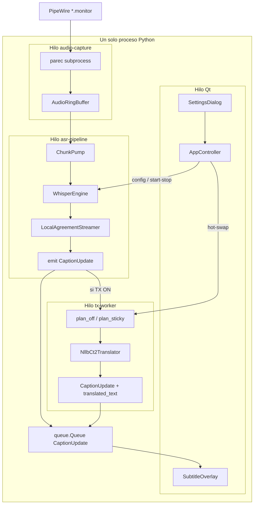
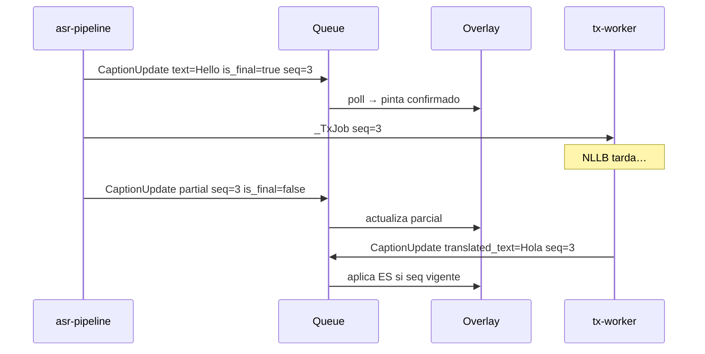
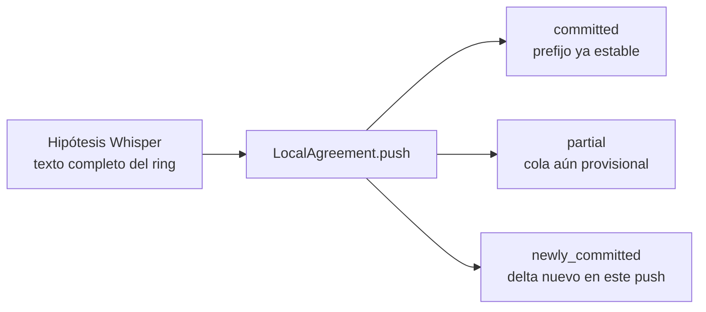
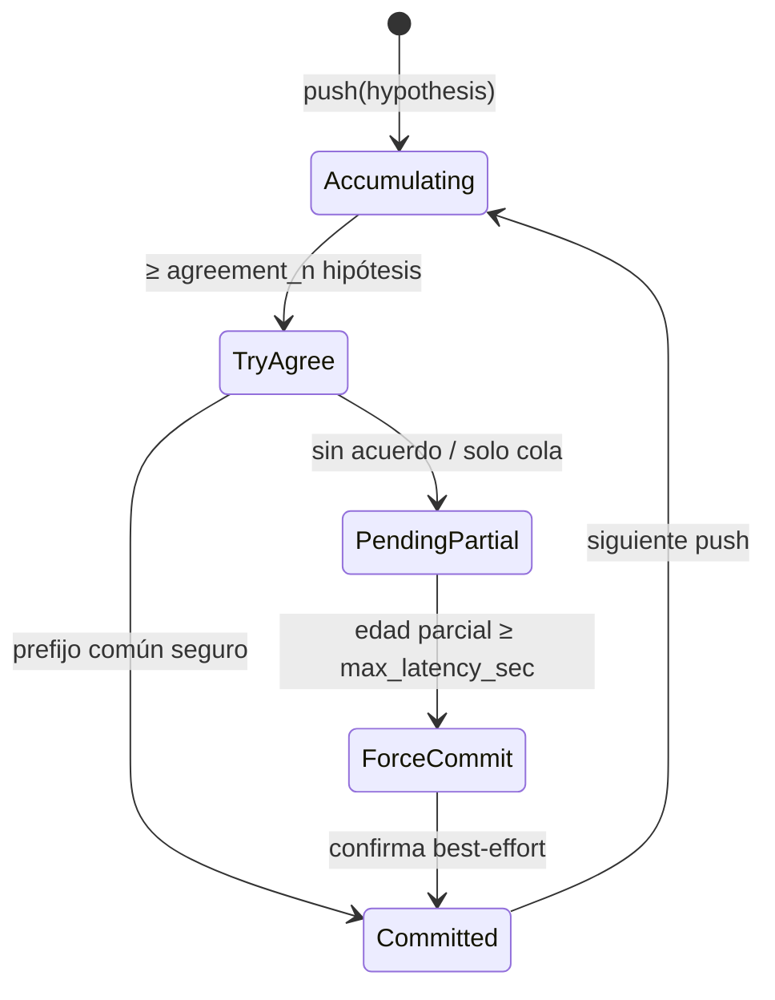
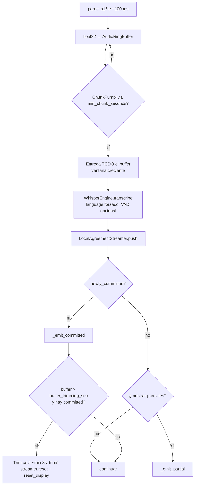
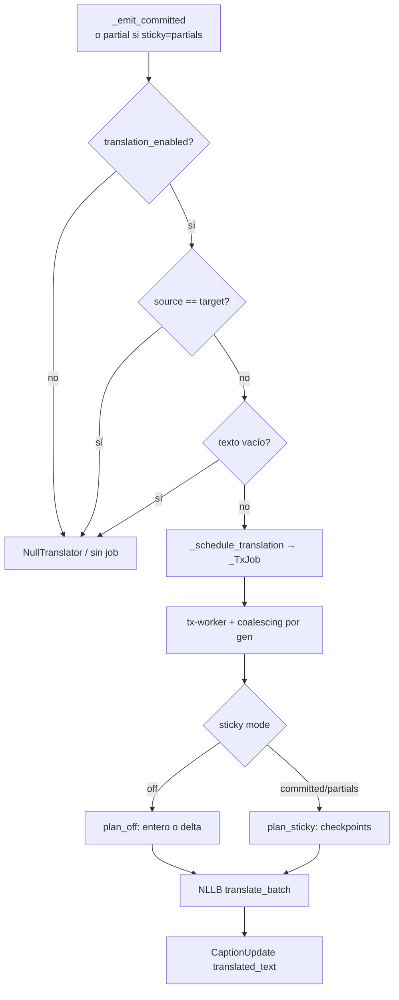
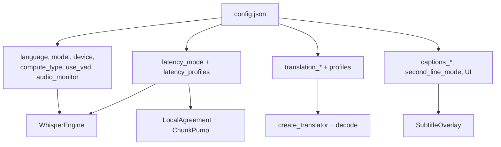

Última modificación: 2026-09-13

# Developers guide — whisperLiveCaptionsLinux

Documento vivo para desarrolladores. Ampliar por secciones; no sustituye intents/specs (esos mandan el alcance). Complementa el mapa corto del pipeline en `[flujo-traductor-2026-09-13.md](../flujo-traductor-2026-09-13.md)` (raíz del repo).

**Fuente de verdad de defaults/clamps:** `src/config.py` (`DEFAULTS`, perfiles de fábrica).  
`config.example.json` / `config.json` son snapshots de usuario y pueden divergir.

---

## Índice

1. [Qué es y qué no es](#1-qué-es-y-qué-no-es)
2. [Arquitectura in-process](#2-arquitectura-in-process)
3. [Hilos y contrato UI](#3-hilos-y-contrato-ui)
4. [Glosario (partials, committed, LocalAgreement, …)](#4-glosario)
5. [Pipeline ASR paso a paso](#5-pipeline-asr-paso-a-paso)
6. [Pipeline de traducción](#6-pipeline-de-traducción)
7. [Política de display (overlay)](#7-política-de-display-overlay)
8. [Parámetros de configuración](#8-parámetros-de-configuración)
9. [Hot-swap vs reinicio](#9-hot-swap-vs-reinicio)
10. [Arranque, tests y debug](#10-arranque-tests-y-debug)
11. [Mapa de código y docs](#11-mapa-de-código-y-docs)
12. [Notas críticas / trampas](#12-notas-críticas--trampas)
13. [Ampliaciones pendientes](#13-ampliaciones-pendientes)

---


## 1. Qué es y qué no es

App de escritorio Linux, **100 % local**, que captura el audio del sistema (monitor PipeWire/Pulse), transcribe con `faster-whisper` (CUDA) y muestra subtítulos en un overlay PyQt6. La traducción (NLLB CT2) es un worker async opcional.


| Sí                                                 | No (hasta spec nuevo)                               |
| -------------------------------------------------- | --------------------------------------------------- |
| Arquitectura **B**: una sola app Python in-process | Servidor/cliente WhisperLive                        |
| Idioma ASR elegido por el usuario                  | Auto-detect de idioma                               |
| PCM 16 kHz mono **en memoria**                     | WAV temporales por chunk                            |
| [LocalAgreement]() propio (`streaming.py`)         | Dependencia de ufal/whisper_streaming como servidor |
| Traducción NLLB aparte                             | `task=translate` de Whisper                         |


---


## 2. Arquitectura in-process




| Capa         | Módulo                                             | Rol                                            |
| ------------ | -------------------------------------------------- | ---------------------------------------------- |
| Orquestación | `src/app.py`                                       | Carga config, cola, arranca overlay + pipeline |
| Config       | `src/config.py`                                    | Defaults, validación, perfiles, presets        |
| Audio        | `src/audio/capture.py`, `devices.py`               | Captura + ring + listado de monitores          |
| ASR          | `src/asr/engine.py`, `pipeline.py`, `streaming.py` | Whisper + LocalAgreement + emisión             |
| Traducción   | `src/asr/translate.py` + worker en `pipeline.py`   | NLLB CT2 async                                 |
| Contrato     | `src/asr/types.py`                                 | `CaptionUpdate`                                |
| UI           | `src/ui/overlay.py`, `settings.py`                 | Overlay + Settings                             |
| Debug        | `src/debug/trace.py`                               | Trazas JSONL / métricas (`tx_lag`)             |


---


## 3. Hilos y contrato UI


### 3.1 Hilos


| Nombre          | Tipo               | Regla                                      |
| --------------- | ------------------ | ------------------------------------------ |
| Qt main         | proceso principal  | Overlay + Settings; **nunca** Whisper/NLLB |
| `audio-capture` | `threading.Thread` | Lee stdout de `parec` → ring               |
| `asr-pipeline`  | `threading.Thread` | Poll, Whisper, LocalAgreement, emit        |
| `tx-worker`     | `threading.Thread` | Decode NLLB + coalescing                   |
| `parec`         | `subprocess.Popen` | Único proceso externo de audio             |


Inferencia ASR y captura **fuera** del hilo Qt. La UI solo consume la cola con un timer (~80 ms).

### 3.2 `CaptionUpdate`

```text
text                 ASR (parcial o confirmado)
is_final             False = partial; True = committed
language             idioma fuente configurado
ts_mono              monotonic clock al emitir
translated_text      destino (None = no tocar línea TX)
seq                  id monotónico por confirmación
translation_append   True = delta a concatenar (modo sticky off)
notice               aviso operativo (p. ej. fallback CPU)
reset_display        True tras buffer trim / nueva frase
```




Reglas UI relevantes:

- Traducciones con `seq` menor que el de la frase en pantalla se **descartan**.
- Con TX ON: línea 1 = traducción; línea 2 según `second_line_mode`.
- `reset_display` limpia buffers de frase en el overlay.

---


## 4. Glosario


### 4.1 Sobre «SRA»

**En este repo no existe SRA** (ni clase, ni flag, ni spec). El streaming es **LocalAgreement** (`LocalAgreementStreamer` en `src/asr/streaming.py`), inspirado en la política homónima de [ufal/whisper_streaming](https://github.com/ufal/whisper_streaming).

Si en conversación se dice «SRA», casi seguro se refiere a uno de estos conceptos reales:


| Nombre en el repo       | Qué es                                                                                   |
| ----------------------- | ---------------------------------------------------------------------------------------- |
| **LocalAgreement**      | Política de confirmar un prefijo cuando coincide en `agreement_n` hipótesis consecutivas |
| **agreement_n**         | Umbral de acuerdo (UI: «Confianza»)                                                      |
| **force-commit**        | Confirmación forzada por `max_latency_sec` sin acuerdo pleno                             |
| **committed / partial** | Prefijo estable vs cola provisional                                                      |


No inventar un acrónimo SRA en código o docs nuevos; usar LocalAgreement.

### 4.2 Hipótesis, committed, partial




Ejemplo con `agreement_n=2`:


| Paso | Hipótesis             | committed     | partial       | newly_committed |
| ---- | --------------------- | ------------- | ------------- | --------------- |
| 1    | `hello world`         | ``            | `hello world` | ``              |
| 2    | `hello world today`   | `hello world` | `today`       | `hello world`   |
| 3    | `hello world tonight` | `hello world` | `tonight`     | ``              |


- **hypothesis**: salida completa de Whisper sobre el audio acumulado (ventana creciente).
- **committed**: prefijo ya confirmado (`streamer.committed`).
- **partial**: `hypothesis[len(committed):]` (normalizado).
- **newly_committed**: trozo que acaba de pasar a committed en este `push()`; el pipeline lo emite como `is_final=True`.


### 4.3 Agreement y force-commit




- `_try_agree`: toma las últimas `agreement_n` hipótesis, calcula prefijo común y lo recorta a **palabra completa** (`_safe_commit_prefix`).
- `_maybe_force_commit`: si hay parcial pendiente más tiempo que `max_latency_sec` y no hubo acuerdo, fuerza commit de la última hipótesis (también con corte seguro de palabra).
- Trade-off: ↑ `agreement_n` → más estable, más latencia; ↓ `max_latency_sec` → menos espera, más commits prematuros.


### 4.4 Commit, emit, flush, lag


| Término                | Significado aquí                                                                                               |
| ---------------------- | -------------------------------------------------------------------------------------------------------------- |
| **commit (streamer)**  | Ampliar `committed` (acuerdo o force)                                                                          |
| `_emit_committed`      | Enviar `CaptionUpdate(is_final=True)`, `seq++`, opcionalmente encolar TX                                       |
| `_emit_partial`        | Enviar display provisional `is_final=False` (mismo `seq`)                                                      |
| **flush_translations** | Esperar a que el tx-worker vacíe jobs (tests/apagado); **no** es flush de captions                             |
| `tx_lag`               | Métrica debug: ms entre commit(`seq`) y `tx_done` del mismo `seq` (`src/debug/trace.py`). No es knob de config |
| **coalescing**         | El worker solo guarda el job más reciente (`gen`); salta obsoletos                                             |


### 4.5 Sticky / checkpoints / delta


| Modo `translation_sticky_mode` | Comportamiento                                                                                  |
| ------------------------------ | ----------------------------------------------------------------------------------------------- |
| `off`                          | Solo confirmados; extensión → delta + `translation_append=True`                                 |
| `committed`                    | Checkpoints `(src, tgt)`; reusa prefijos ya enviados a NLLB; emite ES completo (`append=False`) |
| `partials`                     | Como `committed` + traduce el display `committed+partial`                                       |


Un **checkpoint** es un tramo origen ya mandado a NLLB con su traducción asociada. Sticky evita re-traducir ese prefijo si el texto crece o reescribe solo la cola.

---


## 5. Pipeline ASR paso a paso




Detalle operativo:

1. **Captura** (`SystemAudioCapture`): `parec` → chunks s16le → float32; ring acotado ≈ `buffer_trimming_sec + 5`.
2. **Chunking** (`ChunkPump`): no son ventanas disjuntas; cada poll entrega el **buffer entero** acumulado tras esperar `min_chunk_seconds`.
3. **Whisper**: `task=transcribe`, `condition_on_previous_text=True`, `without_timestamps=True`, `beam_size` = 5 (`stable`) o 1 (`low`).
4. **VAD**: `use_vad` → `vad_filter` en faster-whisper.
5. **Trim**: si el audio crece demasiado y ya hay committed, conserva cola corta, resetea streamer/TX y avisa al overlay con `reset_display=True`.

---


## 6. Pipeline de traducción

ASR **nunca espera** a NLLB. El origen se pinta al instante; la traducción llega después con el mismo `seq` (o se descarta si ya hubo un commit más nuevo).




| Pieza         | Detalle                                                                                  |
| ------------- | ---------------------------------------------------------------------------------------- |
| Factory       | `create_translator()` → `NllbCt2Translator` o `NullTranslator`                           |
| Alias default | `nllb-200-distilled-ct2` → HF `JustFrederik/nllb-200-distilled-600M-ct2-int8`            |
| Compute NLLB  | `int8` fijo (independiente de `compute_type` Whisper)                                    |
| Fallback      | CUDA → CPU con `notice` en overlay                                                       |
| Decode        | `effective_translation_decode()` desde preset + profiles; `max_decoding_length=256` fijo |


Helpers puros (testeables): `plan_off_translation`, `plan_sticky_translation` en `pipeline.py`.

---


## 7. Política de display (overlay)

Flags de fase 2.6 (no cambian LocalAgreement ni latencia ASR):


| Flag                     | Default    | Efecto                                                                  |
| ------------------------ | ---------- | ----------------------------------------------------------------------- |
| `captions_show_partials` | `true`     | Si `false`: no emite/muestra parciales ni agenda TX sticky de parciales |
| `captions_allow_rewrite` | `true`     | Si `false`: solo acepta extensiones del último UI-committed             |
| `second_line_mode`       | `live_asr` | Con TX ON: `live_asr` / `original` / `none`                             |


Estados internos del pipeline a no confundir:


| Estado                                   | Rol                                            |
| ---------------------------------------- | ---------------------------------------------- |
| `_last_committed`                        | Espejo del streamer (sigue aunque UI no emita) |
| `_last_ui_committed`                     | Último texto enviado al overlay (rewrite gate) |
| `_last_tx_committed` / `_tx_checkpoints` | Base de traducción off vs sticky               |


---


## 8. Parámetros de configuración

Valores de **fábrica** (`src/config.py`). Rangos = clamps en `validate_config` / helpers.

### 8.1 ASR / audio


| Parámetro             | Default   | Rango / valores | Efecto                            |
| --------------------- | --------- | --------------- | --------------------------------- |
| `language`            | `en`      | ISO instalado   | Idioma Whisper **forzado**        |
| `model`               | `medium`  | tamaños FW      | Modelo ASR                        |
| `device`              | `cuda`    | `cuda` / `cpu`  | Backend ASR (+ NLLB)              |
| `compute_type`        | `float16` | cuantización FW | Solo Whisper                      |
| `audio_monitor`       | `""`      | nombre Pulse    | Fuente `*.monitor` (vacío → auto) |
| `use_vad`             | `true`    | bool            | `vad_filter`                      |
| `buffer_trimming_sec` | `15.0`    | 5–60 s          | Umbral trim + tamaño ring         |


### 8.2 Latencia / streaming

El modo elige el perfil; los knobs editables viven en `latency_profiles[latency_mode]`.

Los campos top-level `agreement_n` / `max_latency_sec` / `min_chunk_seconds` se **espejan** al validar; la fuente efectiva es el perfil.


| Modo     | `agreement_n` | `max_latency_sec` | `min_chunk_seconds` | `beam_size` Whisper |
| -------- | ------------- | ----------------- | ------------------- | ------------------- |
| `stable` | 2             | 3.0               | 0.8                 | 5                   |
| `low`    | 1             | 1.0               | 0.35                | 1                   |


| Parámetro           | Rango     | Efecto práctico                  |
| ------------------- | --------- | -------------------------------- |
| `latency_mode`      | `stable`  | `low`                            |
| `agreement_n`       | 1–5       | Hipótesis para confirmar prefijo |
| `max_latency_sec`   | 0.5–5.0 s | Techo de force-commit            |
| `min_chunk_seconds` | 0.2–5.0 s | Intervalo mínimo ChunkPump       |


### 8.3 Traducción


| Parámetro                   | Default                      | Efecto          |
| --------------------------- | ---------------------------- | --------------- |
| `translation_enabled`       | `false`                      | Activa NLLB     |
| `translation_target`        | `es`                         | Destino ISO     |
| `translation_sticky_mode`   | `off`                        | `off`           |
| `translator_model`          | `nllb-200-distilled-ct2`     | Alias/repo CT2  |
| `translation_decode_preset` | `balanced`                   | Preset activo   |
| `translation_profiles`      | fast/balanced/quality/custom | Knobs decode    |
| `installed_languages`       | `["en","es"]`                | Menú de idiomas |
| `second_line_mode`          | `live_asr`                   | Layout 2ª línea |


Decoding NLLB (fábrica):


| Preset     | `beam_size`              | `length_penalty` | `no_repeat_ngram_size` |
| ---------- | ------------------------ | ---------------- | ---------------------- |
| `fast`     | 2                        | 1.0              | 0                      |
| `balanced` | 4                        | 1.0              | 3                      |
| `quality`  | 6                        | 1.1              | 3                      |
| `custom`   | editable (seed balanced) | editable         | editable               |


Clamps decode: `beam_size` 1–8, `length_penalty` 0.6–1.5, `no_repeat_ngram_size` 0–5.

### 8.4 Display / apariencia / geometría


| Parámetro                        | Default               | Notas              |
| -------------------------------- | --------------------- | ------------------ |
| `captions_show_partials`         | `true`                | Ver §7             |
| `captions_allow_rewrite`         | `true`                | Ver §7             |
| `always_on_top`                  | `true`                | Hint de ventana    |
| `font_size`                      | `28`                  | 10–100             |
| `font_color` / `bg_color`        | `#ffffff` / `#000000` | CSS overlay        |
| `bg_alpha`                       | `0.55`                | 0.05–1.0           |
| `padding`                        | `24`                  | 0–100 px           |
| `text_align`                     | `center`              | `center`           |
| `window_*` / `settings_window_*` | geometría             | Persistidos por UI |
| `app_preset` / `app_presets`     | `traducción-independiente` / `{…}` | Snapshot de fábrica + mapa de presets |


### 8.5 Flags `opt_*` (no cableados)

En algunos `config*.json` aparecen:

`opt_prefer_low_latency`, `opt_prefer_fast_translation`, `opt_nllb_on_cpu`, `opt_tx_delta_only`, `opt_tx_coalesce_emit`, `opt_perf_metrics`, `opt_short_caption_beam_cap`.

**No están en** `DEFAULTS` **ni se leen en** `src/`**.** Restos de experimentos (p. ej. reduce-tx-lag). El coalescing del tx-worker ya está siempre activo en código. No documentarlos como knobs productivos hasta cablearlos + spec.




---


## 9. Hot-swap vs reinicio


| Cambio                                                                    | Comportamiento                                                                                                 |
| ------------------------------------------------------------------------- | -------------------------------------------------------------------------------------------------------------- |
| `language`, `model`, `audio_monitor`, `device`, `compute_type`, `use_vad` | **Reinicia** pipeline ASR                                                                                      |
| Latencia (`latency_mode` / perfiles)                                      | Hot-swap vía `apply_latency_settings` (reinicia streamer con nuevos knobs; no recarga modelo si no hace falta) |
| Traducción enable/target/sticky/preset/profiles                           | Hot-swap `apply_translation_settings`; recrea `Translator` si cambian enable/modelo/device                     |
| Display (`captions_*`, `second_line_mode`, apariencia)                    | Hot-swap UI / flags                                                                                            |


Al cambiar sticky mode o tras trim/start/stop: reset de checkpoints TX.

---


## 10. Arranque, tests y debug

```bash
make run          # libs PyQt6 + QT_QPA_PLATFORM=xcb por defecto
make test         # pytest -q (sin GPU)
make lint         # ruff
```

Debug opcional: `src/debug/trace.py` (sesión JSONL; útil para `tx_lag` y correlacionar `seq`).

Cierre cooperativo: `AsrPipeline.stop()` + `SystemAudioCapture.stop()` desde `AppController.shutdown`.

---


## 11. Mapa de código y docs


### Código


| Path                   | Por qué                           |
| ---------------------- | --------------------------------- |
| `src/app.py`           | Wiring hilos/config               |
| `src/config.py`        | Schema / defaults / presets       |
| `src/asr/streaming.py` | LocalAgreement                    |
| `src/asr/pipeline.py`  | Loop ASR, emit, TX worker, sticky |
| `src/asr/engine.py`    | Whisper + VAD + beam              |
| `src/asr/translate.py` | NLLB / NullTranslator             |
| `src/asr/types.py`     | `CaptionUpdate`                   |
| `src/audio/capture.py` | Ring + captura + ChunkPump        |
| `src/ui/overlay.py`    | Consumo de updates                |
| `src/ui/settings.py`   | Persistencia UI                   |
| `src/debug/trace.py`   | Métricas / trazas                 |


### Specs / intents (por tema)


| Tema                         | Docs                                                     |
| ---------------------------- | -------------------------------------------------------- |
| Producto base                | `docs/intent/subtitulos-directo-…`, `docs/specs/fase1-…` |
| Baja latencia / force-commit | fase 2.1                                                 |
| Traducción EN→ES             | fase 2.2                                                 |
| Idiomas instalados           | fase 2.3                                                 |
| Presets decode NLLB          | fase 2.4                                                 |
| Sticky modes                 | fase 2.5                                                 |
| Partials / rewrite           | fase 2.6                                                 |
| Alineación texto             | fase 2.7                                                 |
| App presets                  | fase 2.8                                                 |
| Flujo corto TX               | `flujo-traductor-2026-09-13.md` (raíz)                   |


---


## 12. Notas críticas / trampas

1. **No confundir beam ASR y beam NLLB.** El de Whisper lo fija `latency_mode`; el de NLLB viene de `translation_profiles`.
2. **Whisper no traduce.** Aunque el idioma fuente sea `es`, `task` sigue siendo `transcribe`; la ES de destino es NLLB (o passthrough si source==target).
3. **Ventana creciente, no sliding window clásica.** Cada transcribe ve casi todo el ring hasta el trim → coste GPU crece con el buffer.
4. `agreement_n=1` confirma en cuanto hay hipótesis «segura» de palabra; con force-commit agresivo la estabilidad cae.
5. **Top-level latency knobs** en JSON pueden engañar: edita `latency_profiles[mode]` o el modo activo tras validate.
6. `opt_*` **en config de ejemplo** no hacen nada hoy; no basar experimentos en ellos sin cablear.
7. **Criticismo de diseño (candidato a ampliar):** medir y exponer `tx_lag` p50/p95 en Settings o debug panel sería más útil que flags muertos; y documentar un «budget» de latencia extremo-a-extremo (audio→partial→commit→TX) evitaría tunear knobs a ciegas.

---


## 13. Ampliaciones pendientes

Secciones candidatas para ir añadiendo:

- [ ] Diagrama de secuencia sticky (extensión vs rewrite de cola) con ejemplos literales EN→ES
- [ ] Guía de tuning: matrices latencia × modelo × sticky observadas en hardware real
- [ ] Overlay: layout de labels (`final` / `partial` / `translated` / `notice`) y chrome
- [ ] App presets: qué entra en el snapshot y qué es meta
- [ ] Fallos CUDA / drivers: mensajes accionables y recovery
- [ ] Checklist de contribución: intent → spec → plan → implement (skill `phase-workflow`)

---

*Al ampliar este doc: actualizar la línea* `Última modificación` *y, si el cambio es de alcance de producto, el spec correspondiente antes del código.*