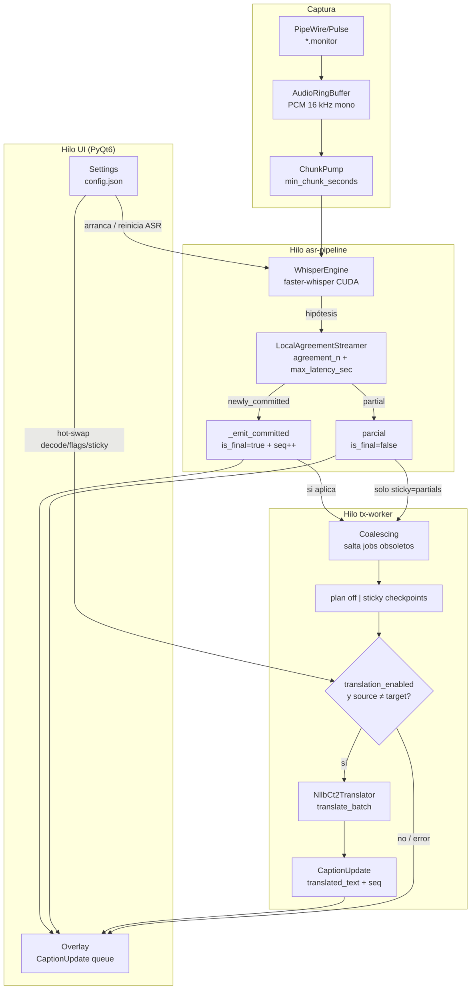
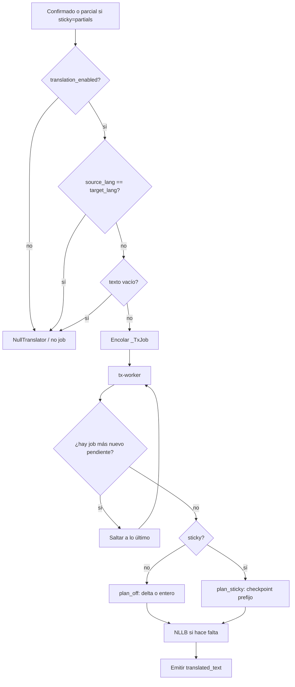
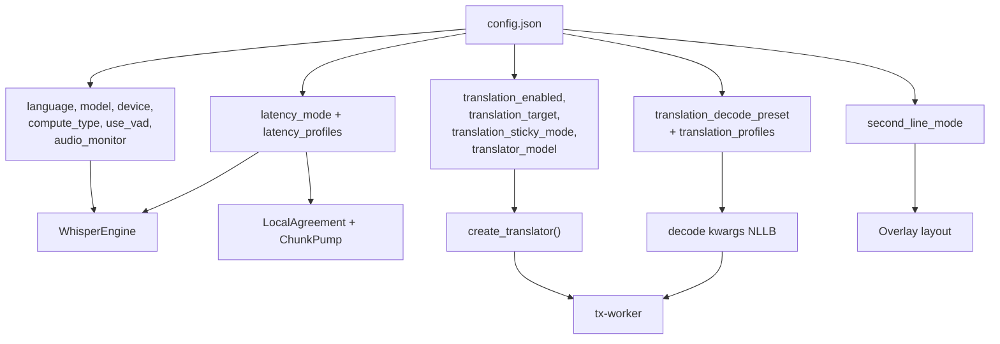

Última modificación: 2026-09-13

# Flujo del traductor (ASR → NLLB)

Documento de referencia del pipeline in-process: captura → Whisper → LocalAgreement → overlay, y traducción async.

Código clave: `src/asr/pipeline.py`, `src/asr/engine.py`, `src/asr/streaming.py`, `src/asr/translate.py`, `src/config.py`.

---

## 1. Flujo principal



### Reglas de diseño (importantes)

| Regla | Comportamiento |
| --- | --- |
| Default (`sticky=off`) | Solo confirmados; parciales no se traducen. |
| Sticky `committed` | Solo confirmados; reutiliza checkpoints (no re-traduce prefijos ya enviados a NLLB). |
| Sticky `partials` | Como committed + traduce el display de la hipótesis. |
| ASR no espera a NLLB | El texto origen se emite al instante; la ES llega después con `seq` vigente. |
| Passthrough | Si `language == translation_target` (p. ej. `es→es`), no se traduce. |
| Delta / sticky | Off: extensión → delta append. Sticky: ES completo con `append=false`. |
| Coalescing | Salta a lo último por `gen` monotónico (incluye parciales con mismo `seq`). |
| Fallo NLLB | Se loguea y se muestra solo ASR; no se tumba el overlay. |

---

## 2. Decisión: ¿se traduce este texto?



Config: `translation_sticky_mode` = `off` | `committed` | `partials` (Settings → Traducciones).

---

## 3. Parámetros de transcripción (ASR)

Fuente: `WhisperEngine` + perfil de latencia (`effective_latency_profile`). Cambiar idioma/modelo/audio/latencia **reinicia** el pipeline.

### 3.1 Modelo y audio

| Parámetro | Config | Default | Qué hace |
| --- | --- | --- | --- |
| `language` | idioma fuente manual | `en` | Forzado en Whisper (`task=transcribe`). **Sin auto-detect.** |
| `model` | tamaño Whisper | `medium` | `small` / `medium` / `large-v3-turbo` / `large-v3` |
| `device` | backend | `cuda` | Dispositivo CTranslate2/faster-whisper |
| `compute_type` | cuantización ASR | `float16` | Precisión del motor Whisper |
| `audio_monitor` | fuente PipeWire/Pulse | `""` | Dispositivo `*.monitor` a capturar |
| `use_vad` | filtro VAD | `true` | `vad_filter` en `transcribe()` |
| `buffer_trimming_sec` | recorte ring buffer | `15.0` | Si el buffer crece de más, conserva cola ~8 s y resetea streamer |

Fijos en código (no expuestos en UI): `condition_on_previous_text=True`, `without_timestamps=True`, `task="transcribe"` (Whisper **no** usa `task=translate`; la traducción a ES es NLLB aparte).

### 3.2 Latencia / streaming (`latency_mode`)

El modo elige el perfil; los knobs editables viven en `latency_profiles[mode]`.

| Modo | `agreement_n` | `max_latency_sec` | `min_chunk_seconds` | `beam_size` Whisper |
| --- | ---: | ---: | ---: | ---: |
| `stable` | 2 | 3.0 | 0.8 | **5** |
| `low` | 1 | 1.0 | 0.35 | **1** |

| Parámetro | Rango | Efecto |
| --- | --- | --- |
| `agreement_n` (UI: Confianza) | 1–5 | Cuántas hipótesis consecutivas deben coincidir en un prefijo antes de confirmar. ↑ = más estable y lento. |
| `max_latency_sec` (UI: Techo) | 0.5–5.0 s | Si el parcial no se confirma a tiempo, se fuerza commit. ↓ = menos retraso, más riesgo prematuro. |
| `min_chunk_seconds` | fijo por modo | Intervalo mínimo entre polls de audio hacia Whisper. |
| `beam_size` (ASR) | derivado del modo | No es el beam de NLLB. `low→1`, `stable→5`. |

---

## 4. Parámetros de traducción

Dos motores detrás del mismo protocolo `Translator`:

- **`MarianCt2Translator`** (default, `opus-mt-tc-big`): Opus-MT tc-big en CT2 int8, un
  modelo por idioma de origen según el registro de `src/asr/opusmt.py`. Los pesos se
  convierten en la instalación y viven en local, no en la caché de Hugging Face.
- **`NllbCt2Translator`** (`nllb-200-distilled-ct2` / `-1.3b-ct2`): un solo modelo
  multilingüe desde Hugging Face. Para idiomas sin `tc-big` hacia español.

Hot-swap: cambiar enable/target/sticky/preset/profiles **no** reinicia ASR; solo recrea el `Translator` si cambia su `translator_fingerprint()` (enable, modelo, device, y el idioma cuando el motor elige modelo por idioma).

### 4.1 Flags y motor

| Parámetro | Default | Qué hace |
| --- | --- | --- |
| `translation_enabled` | `false` | OFF → `NullTranslator` (passthrough). ON → carga el motor lazy/preload. |
| `translation_target` | `es` | Idioma destino ISO. Opus-MT solo va a `es`; NLLB admite el resto. |
| `translation_sticky_mode` | `off` | `off` / `committed` / `partials` (ver §1). |
| `translator_model` | `opus-mt-tc-big` | Motor, alias de NLLB o repo CT2 propio. |
| `device` | mismo que ASR | `cuda` con fallback a CPU int8 si falla la carga. |
| `compute_type` | Marian `int8_float16`, NLLB `int8` | Independiente del `compute_type` de Whisper. |
| `second_line_mode` | `live_asr` | Solo UI: `live_asr` / `original` / `none`. |

### 4.2 Decoding (presets de calidad)

Valores efectivos vía `effective_translation_decode(config)` según `translation_decode_preset` + `translation_profiles`.

| Preset | `beam_size` | `length_penalty` | `no_repeat_ngram_size` | Uso típico |
| --- | ---: | ---: | ---: | --- |
| `fast` | 2 | 0.7 | 3 | Menos latencia / CPU |
| `balanced` | 4 | 0.7 | 3 | Default recomendado |
| `quality` | 6 | 0.7 | 3 | Mejor calidad, más lento |
| `custom` / usuario | editable | editable | editable | Perfil persistente o presets guardados |

`length_penalty` 0.7 en los tres: medido, con 1.0 el decoder rellena los fragmentos cortos («oui» → «Sí, sí.»). Evitar `beam_size=1` en cualquier motor: es un precipicio de calidad.

Fijo en decode: `max_decoding_length` 96 en Marian, 256 en NLLB. El techo bajo de Marian es una salvaguarda: una línea de subtítulo nunca pasa de 96 tokens y así una alucinación no consume cientos de milisegundos.

---

## 5. Contrato hacia el overlay

```text
CaptionUpdate
  text              → ASR (parcial o confirmado)
  is_final          → False = parcial; True = confirmado
  language          → idioma fuente configurado
  translated_text   → ES (u otro target) en updates de traducción (también parciales si sticky=partials)
  seq               → id monotónico por confirmación; traducciones viejas se descartan
  translation_append→ True si la ES es un delta a concatenar (modo off)
```

Con traducción ON: línea 1 = traducción; línea 2 según `second_line_mode`.

---

## 6. Mapa rápido config → componente


